<!-- ====================== HEADER ====================== -->

<a href="https://github.com/putianan65">
  <picture>
    <source media="(prefers-color-scheme: dark)" srcset="https://readme-typing-svg.demolab.com?font=Fira+Code&weight=600&size=24&duration=3000&pause=900&color=C4B5FD&center=true&vCenter=true&width=700&height=50&lines=%E0%B8%AA%E0%B8%A7%E0%B8%B1%E0%B8%AA%E0%B8%94%E0%B8%B5%E0%B8%84%E0%B8%A3%E0%B8%B1%E0%B8%9A+%E0%B8%A7%E0%B8%B1%E0%B8%99%E0%B8%99%E0%B8%B5%E0%B9%89%E0%B9%80%E0%B8%82%E0%B8%B5%E0%B8%A2%E0%B8%99%E0%B9%82%E0%B8%84%E0%B9%89%E0%B8%94%E0%B8%AB%E0%B8%A3%E0%B8%B7%E0%B8%AD%E0%B8%A2%E0%B8%B1%E0%B8%87;I+build+mobile+apps+with+Flutter+%26+React+Native;Full-stack+with+NestJS+%2B+Next.js;Pair+programming+with+AI+every+day" />
    
  </picture>
</a>

 

<!-- ====================== ABOUT ====================== -->

## About Me

สวัสดีครับ ผม **ภูติอนันต์** (เรียกผมว่า **แอล** ก็ได้ครับ)

ผมจบสาขา IT จากมหาวิทยาลัยเทคโนโลยีราชมงคลล้านนา ตาก และหลงใหลในการพัฒนา Software ร่วมกับ AI ตอนนี้กำลังศึกษาแนวทางของ AI Engineer เพื่อนำมาสร้างแอปพลิเคชันต่าง ๆ ให้ใช้งานได้จริง ผมเป็นคนมีความคิดสร้างสรรค์ ชอบลองของใหม่ และไม่เคยหยุดเรียนรู้

เวลาว่างผมมักอ่านบทความเกี่ยวกับการพัฒนา Software และติดตามข่าวสารด้านเทคโนโลยีอยู่เสมอ รวมถึงศึกษาเรื่องความปลอดภัยของระบบควบคู่ไปกับการใช้ AI เพราะเชื่อว่าสองเรื่องนี้ต้องเดินไปด้วยกัน

ผมยังชอบช่วยเหลือและแนะนำเรื่องพื้นฐานให้เพื่อน ๆ ใน Community ที่เพิ่งเริ่มพัฒนาระบบแต่ยังไม่รู้ว่าจะเริ่มตรงไหน ถ้าสนใจเรื่องพวกนี้เหมือนกัน ยินดีแลกเปลี่ยนกันครับ

 

<!-- ====================== TECH STACK ====================== -->

## Tech Stack

**Languages**

**Mobile**

**Frontend & Backend**

**Tools**

**AI Tools**

<!-- ====================== PROJECTS ====================== -->

## Featured Projects

| Project | Stack | Description |
| :-- | :-- | :-- |
| [**MoodTrackerApp**](https://github.com/putianan65/MoodTrackerApp) |  | แอปติดตามอารมณ์ประจำวัน |
| [**taptom-mobile**](https://github.com/putianan65/taptom-mobile) |  | แอปมือถือ TapTom |
| [**employee_task_tracker**](https://github.com/putianan65/employee_task_tracker) |  | ระบบติดตามงานพนักงาน |

<!-- ====================== FOOTER ====================== -->

ถ้าชอบผลงาน ฝากกด Star ให้ด้วยนะครับ

